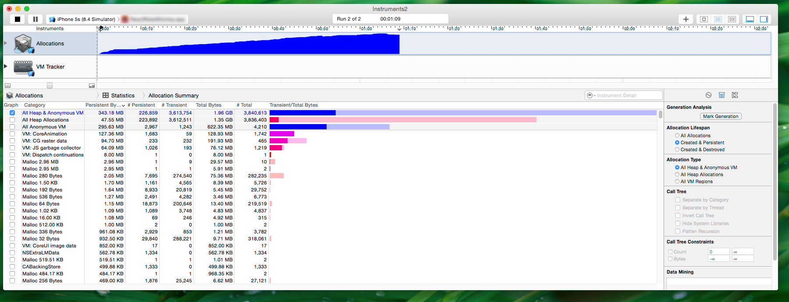
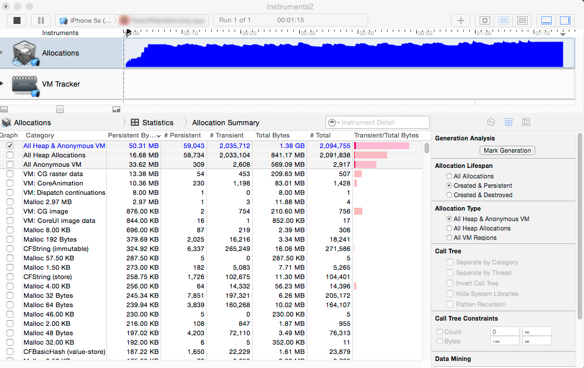

# React Native SGListView

SGListView is a memory minded implementation of the React Native's ListView.

## Maintainers Wanted

I'm currently looking for maintainers to help maintain and improve this package for the React-Native community. For more information please see [GitHub Issue #48](https://github.com/sghiassy/react-native-sglistview/issues/48).

## The Problem

The React Native team has done a tremendous job building a robust platform. One oversight, is the memory performance of their ListView implementation. When scrolling down long lists, the memory footprint increases linearly and will eventually exhaust all available memory. On a device as memory-constrained as a mobile device, this behavior can be a deal breaker for many.


An example of ListView performance for long lists.

## The Solution

SGListView resolves React Native's ListView memory problem by controlling what's being drawn to the screen and what's kept in memory. When cells are scrolled off screen, SGListView intelligently flushes their internal view and only retains the cell's rendered bounding box - resulting in huge memory gains.


An example of SGListView performance for long lists.


## Installation

Install via yarn of npm

```bash
#yarn
yarn add react-native-sglistview

#npm
npm install react-native-sglistview --save
```

## Usage

SGListView was designed to be a developer-friendly drop-in replacement for ListView. Simply import the package and change the `ListView` references in the render methods to `SGListView`. Nothing else. No fuss, no muss.

### Import
Import SGListView

```js
import SGListView from 'react-native-sglistview';
```
### Rename
Change references from `ListView` to `SGListView`.

From:
```jsx
<ListView ... />
```
To:
```jsx
<SGListView ... />
```

### Done
That's it. If you had a working list view and did the above two steps everything should work. If you're instead creating a ListView from scratch, then you'll need to do all the regular setup that the default ListView requires (i.e: Create and link up your datasource `const dataSource = new ListView.DataSource(...)`).

## Simple Example

```js
import React from 'react';
import { ListView } from 'react-native';
import SGListView from 'react-native-sglistview';

const LIST_VIEW = 'listview';

class CardListView extends React.Component {
  static renderRow(rowData, sectionID, rowID) {
    return (
      <View>
        <Text>{rowData.title}</Text>
      </View>
    );
  }

  render() {
    return (
      <SGListView
        ref={LIST_VIEW}
        dataSource={this.getDataSource()}
        renderRow={this.renderRow}
      />
    );
  }

  getDataSource() {
    const dataSource = new ListView.DataSource(
      { rowHasChanged: (r1, r2) => r1.uuid !== r2.uuid });

    const deals = this.props.deals.length > 0;
    return deals ? dataSource.cloneWithRows(this.props.deals) : dataSource;
  }
}

```

## Working App Example

To view a fully working app example, check out the example app at: https://github.com/sghiassy/react-native-sglistview-example


#### Reference Configuration
SGListView passes its props to React-Native's ListView. If ListView requires a prop, then you must supply that prop to SGListView so it can pass it down. For more information read these two RN official documents: [ListView component](http://facebook.github.io/react-native/releases/0.31/docs/listview.html)  [ListView performance optimize](http://facebook.github.io/react-native/releases/0.31/docs/performance.html#listview-initial-rendering-is-too-slow-or-scroll-performance-is-bad-for-large-lists)

SGListView Component
```jsx
  <SGListView
    dataSource={this.getDataSource() } //data source
    ref={'listview'}
    initialListSize={1}
    stickyHeaderIndices={[]}
    onEndReachedThreshold={1}
    scrollRenderAheadDistance={1}
    pageSize={1}
    renderRow={(item) =>
      <ListItem>
        <Text>{item}</Text>
      </ListItem>
    }
  />
```

## Configuration

SGListView provides a couple methods and options in addition to React-Native's ListView component. They are detailed here:

### Methods

  * **getNativeListView**: Sometime you want to be able to interact with SGListView's underlying ListView instance. You can get a reference to the underlying `ListView` element from `SGListView` by calling this method.

## Options

  * **premptiveLoading (type: integer)**: SGListView will dump the internal view of each cell as it goes off the screen. Conversely, when the cell comes back on the screen, we repopulate the cell with its view. If this transition happens too late in the process, the user will see a flash on screen as the cell transitions from a blank bounding box to its full view representation. SGListView prevents this from happening by preemptively loading cells before they come on screen. By default, we load 2 cells in the future before they come on screen. SGListView allows you to override the number of cells to load preemptively through the prop *premptiveLoading*. **Note**: Because of this logic, its advised not to use ListView's prop *scrollRenderAheadDistance* as they can be in conflict with one another.

## FAQ

### Does this approach reuse cells?

Unfortunately no. Instead what SGListView does is to dump the internal view of cells as they scroll off screen, so that only a simple bounding box of the cell remains in memory.

### Why do you keep cells around when they go off screen? Why don't you just remove them?

We keep cells around because we wanted SGListView to be a high-fidelity drop-in replacement for ListView - which meant sacrificing performance for compatibility.

We wanted pixel perfection between ListView and SGListView. This meant that we had to rely on ListView's underlying CSS engine to keep pixel level fidelity between ListView layouts and SGListView layouts. With flexbox styling, removing a cell from a grid can cause a reflow of all remaining cells and therefore could mess with design fidelity. Keeping the bounding box in memory resolved any and all layout concerns.

### Why didn't you wrap a UICollectionView / UITableView?

One key goal for this project was to make the final solution platform independent. Using an underlying UICollectionView or UITableView would've tied the implementation to iOS's UIKit and was something we worked to avoid.

## Authors

Shaheen Ghiassy <shaheen.ghiassy@gmail.com>

## Contributing

My attempt will be made to review PRs promptly - but truthfully I'm pretty bad at it.
